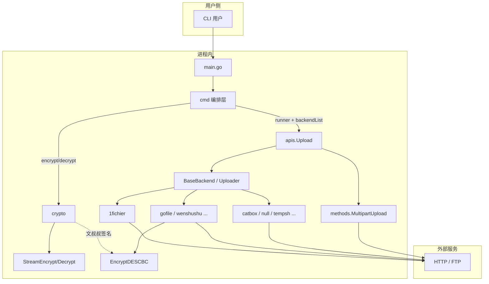
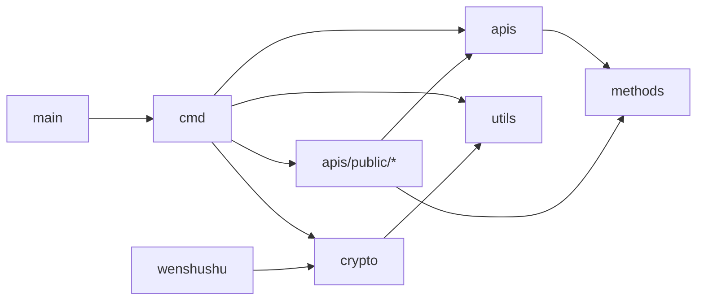
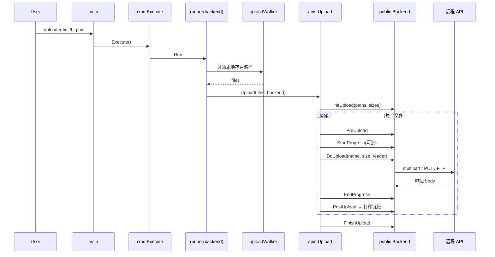

# uploader 项目架构深度分析

## 1. 项目全局摘要

本仓库是一个基于 Go 的命令行大文件上传工具，通过统一的后端插件接口对接 12 个公开文件托管/临时分享服务，并附带本地 AES 文件加解密能力。代码体量小、结构扁平（`cmd` + `apis` + `crypto` + `utils`），无服务端、无数据库，本质是「CLI 编排 + HTTP/FTP 适配器」的客户端工具。整体复杂度偏低，适合作为多源上传 CLI 的参考实现，但存在若干未接线功能（上传加密、ECE、LinkMatcher）与历史 fork（`transfer`）残留。

---

## 2. 系统架构分析

本章基于目录结构与模块依赖，还原系统的实际运行形态。

### 2.1 总体架构分析

系统为单进程 CLI：入口 `main` 委托 `cmd` 完成 Cobra 命令树；上传路径经 `apis.Upload` 编排生命周期钩子，具体协议由 `apis/public/*` 适配器实现；加解密路径独立走 `crypto`。无常驻服务、无控制面/数据面拆分。



模块依赖关系（静态 import）：



### 2.2 核心技术栈与基础设施

从 `go.mod`、`Makefile`、`.goreleaser.yml` 观察到的选型如下：

| 类别 | 选型 | 用途 |
|------|------|------|
| 语言 | Go 1.18 | 静态编译跨平台 CLI |
| CLI | spf13/cobra | 命令树与 PersistentFlags |
| 进度条 | cheggaaa/pb/v3 | 上传/加密进度 |
| 加密 | golang.org/x/crypto、标准库 crypto | AES/DES；ECE 子包未接线 |
| FTP | jlaffaye/ftp | 1fichier FTP 上传 |
| 其它 | uuid、base58、concurrent-map | 协议/工具辅助 |
| 发布 | Makefile 多 OS 交叉编译；GoReleaser | 产出名为 `transfer` 的二进制（与模块名 `uploader` 不一致） |

无 Docker、无 CI workflow、无外部数据库或消息中间件。

### 2.3 架构反模式与技术债

基于当前实现，可客观指出以下问题：

1. **未接线能力**：`--encrypt` / `--encrypt-key` 已写入 `TransferConfig`，但上传路径从未消费；`LinkMatcher`、`request.go` 的 `writeCounter`、`monitor`、整个 `crypto/ece` 与 `rsa` 均为死代码或不可外包使用。
2. **命名残留**：帮助文案、Makefile 产物名仍为 `transfer`；`lit` 的 alias 为 `littlebox`（站点为 litterbox）；`cnet` 帮助写 `paste.c-net.org`，代码却打到 `temp.sh/upload`。
3. **安全默认值偏弱**：多数上传客户端 `InsecureSkipVerify: true`；AES 流式加密使用固定 IV（16 个 `'7'`），且按读块分别 Padding，非标准整文件 CBC。
4. **注册表与契约分离**：后端注册在 `cmd/controller.go`，接口在 `apis`，扩展需改两处；后端子命令全部 `Hidden=true`，可发现性差。
5. **错误与 HTTP**：多数 provider 不校验 HTTP 状态码，仅解析 body；单文件失败不中断后续文件，行为合理但缺少统一错误类型。

---

## 3. 核心模块代码深度解析

本章按模块说明职责、关键类型与内部算法，构成本文档主体。

### 3.1 命令编排模块实现解析

本模块位于 `cmd/`，是进程的控制面。

- **核心职责**：注册根命令与全局 flag；按 `backendList` 动态挂载隐藏后端子命令；解析参数并调用 `apis.Upload` 或 `crypto.Encrypt/Decrypt`；未知命令时兜底到 1fichier。
- **关键数据结构**：包内无自定义 struct。核心状态为 `backendList [][]any`（短名、长名、Backend 实例）以及 `VersionMode` / `KeepMode`。
- **状态流转与核心算法**：
  - `Execute()` → `rootCmd.Execute()`；失败且为 unknown command → `handleRootTransfer`。
  - `runner(backend)`：`uploadWalker`（`utils.IsExist`）→ `apis.Upload`。
  - `encrypt`/`decrypt`：同样 walker → `crypto.Encrypt`/`Decrypt`。
  - 目录递归展开不在 walker，而在 `apis.Upload` 的 `filepath.Walk`。

后端注册表（12 个）：

| 短名 | 长名 | 包 |
|------|------|-----|
| fic | 1fichier | public/1fichier |
| anon | anonfiles | public/anonfiles |
| bash | bashupload | public/bashupload |
| cat | catbox | public/catbox |
| cnet | cnet | public/cnet |
| gg | downloadgg | public/downloadgg |
| gof | gofile | public/gofile |
| lit | littlebox | public/litterbox |
| nil | null | public/null |
| temp | temp | public/tempsh |
| tmpf | tempfiles | public/tmpfiles |
| wss | wenshushu | public/wenshushu |

### 3.2 上传框架与适配器模块实现解析

本模块位于 `apis/`，是上传业务的核心抽象。

- **核心职责**：定义 `BaseBackend` / `Uploader` 生命周期；`Upload` 编排扫文件、进度条与钩子；`methods` 提供通用流式 multipart；`public/*` 实现各站点协议。
- **关键数据结构**：

```text
BaseBackend
  ├── Uploader
  │     InitUpload / PreUpload / DoUpload / PostUpload / FinishUpload
  │     StartProgress / EndProgress
  ├── SetArgs(*cobra.Command)
  └── LinkMatcher(string) bool   # 未实现、未调用

Backend 嵌入 BaseBackend + *pb.ProgressBar
  默认 DoUpload → panic；其余钩子空实现
```

各 provider 典型形态：`var Backend = new(xxx)`，结构体嵌入 `apis.Backend`，覆写 `DoUpload`（及可选 Init/Pre/Finish），`PostUpload` 打印下载链接。

- **状态流转与核心算法**：
  1. `Upload`：MuteMode 时重定向 stdout；Walk 收集 paths/sizes；`InitUpload`；逐文件 `Pre → Open → StartProgress → DoUpload → EndProgress → Post`；可选 `-o` 追加链接；`FinishUpload`。
  2. Multipart：`methods.MultipartUpload` 用 `io.Pipe` 流式拼表单字段 `file`；部分站点自研 multipart（自定义字段如 catbox 的 `reqtype`）。
  3. 特例：文叔叔分块并发 PUT + DES 签名；1fichier 可走 FTP；gofile 在 Init 阶段选服务器。

Provider 能力差异摘要：

| Provider | 主要协议 | 钩子覆盖 | 备注 |
|----------|----------|----------|------|
| 1fichier | HTTP multipart / FTP | DoUpload | 默认后端；密码/API Key/邮箱 |
| gofile | multipart + 选服 | Init + Do | `--single` 已声明未用 |
| wenshushu | JSON API + 分块 PUT | Init/Pre/Do/Finish | 最复杂；`--password` 未真正生效 |
| catbox/litterbox/null 等 | multipart | Do + Post | 字段与 UA 因站点而异 |
| anonfiles/tmpfiles 等 | 共享 MultipartUpload | Do + Post | JSON 或明文链接 |

### 3.3 密码学模块实现解析

本模块位于 `crypto/`（含 `ece/`）。

- **核心职责**：CLI 侧 AES-CBC 流式文件加解密；为文叔叔提供 `EncryptDESCBC`；ECE/RSA/部分 AES 块函数处于未接线状态。
- **关键数据结构**：包级 flag 变量 `Prefix`/`Key`/`ForceMode`/`NoBar`；ECE 侧 `Engine` + `operationalParams`（构造入口 `newEngine` 未导出，包外无法使用）。
- **状态流转与核心算法**：
  - `Encrypt`：解析输出路径；空密钥则随机 16 字节 hex；短密钥 Padding 到 32；`StreamEncrypt`（CBC，固定 IV 全 `'7'`，按 ≤1MiB 读块分别 Padding）。
  - `Decrypt`：必须提供合法密钥；`StreamDecrypt`。
  - 文叔叔：`md5` → base58 → DES-CBC(key=timeIV) → base64，用于请求签名。
  - ECE：RFC8188 AES-GCM + HKDF，全仓库无 import。

注意：CLI 帮助写「AES-ECB」，实现为 AES-CBC，文档与代码不一致。

### 3.4 工具模块实现解析

本模块位于 `utils/`，为薄工具函数集。

- **核心职责**：路径存在性（`IsExist`/`IsDir`/`IsFile`）、随机串（`GenRandString`/`GenRandUUID`）、URL-safe Base64、进度点动画等。
- **关键数据结构**：无业务 struct，纯函数。
- **状态流转**：被 `cmd/walker`、`crypto/command` 等调用；无独立状态机。

---

## 4. 核心功能执行流程分析

本章追踪主路径的动态调用链与异常策略。

### 4.1 核心业务调用链

以「指定后端上传文件」为主路径（例如 `uploader fic ./big.bin`）：



加解密路径更短：`encrypt`/`decrypt` → walker → `crypto.Encrypt`/`Decrypt` → `StreamEncrypt`/`StreamDecrypt`。

无后端时：`unknown command` → `handleRootTransfer` → 警告并默认 `fichier.Backend`。

### 4.2 异常处理机制

当前错误策略偏「记录并继续」，缺少统一错误类型与重试框架（文叔叔 `newRequest` 除外，最多重试 3 次）。

| 层级 | 行为 |
|------|------|
| `cmd.Execute` | 非 unknown 错误打印后 `os.Exit(1)` |
| `apis.Upload` | Walk/Init 失败则 return；单文件失败打 stderr，继续下一文件 |
| Provider | 多为 `fmt.Errorf` 向上返回；部分不检查 HTTP status |
| 默认 `DoUpload` | 未覆写则 `panic` |
| MuteMode | 吞正常 stdout，错误仍写 stderr；成功链接打到原 stdout |

---

## 5. 质量与性能评估

本章从静态代码观察并发、性能与安全边界。

### 5.1 并发与性能瓶颈

- **上传主路径串行**：`Upload` 对文件列表 for 循环顺序上传，无全局并行（文叔叔内部可对分片并发 PUT，由 `-p/--parallel` 控制）。
- **流式 multipart**：使用 pipe + 分块读，避免整文件进内存，适合大文件。
- **进度条**：`pb.NewProxyReader` 包装读流，Mute/`--no-progress` 可关闭以减 I/O 开销。
- **潜在问题**：文叔叔分片失败会把 part 重新放回 channel，极端情况下可能自旋；`crypto` 中 WaitGroup 未真正异步，无实际并发收益。

### 5.2 安全边界审查

- **无 AuthN/AuthZ**：纯本地 CLI；部分后端支持用户 cookie/API Key（文叔叔、1fichier），凭据经 flag 传入，无安全存储。
- **TLS**：普遍跳过证书校验，中间人风险高。
- **本地加密**：固定 IV、按块 Padding 的「CBC」弱于标准做法；帮助文案误导为 ECB。
- **敏感输出**：随机生成密钥时打印到 stdout，适合交互使用，不适合自动化流水线静默场景。

---

## 6. 项目构建与部署

本章完全基于仓库内基础设施文件归纳。

### 6.1 编译与依赖管理

- **环境**：Go ≥ 1.18；`CGO_ENABLED=0` 静态链接。
- **依赖**：`go mod`（`go.mod` / `go.sum`），无系统级服务依赖。
- **本地构建**：

```bash
go build -o uploader main.go
# 或
make all          # setup + linux/freebsd/osx/windows 多架构
make build-linux
make build-osx
make build-windows
```

Makefile 产物目录为 `bin/{linux,freebsd,osx,windows}/`，二进制前缀为 **`transfer`**（非 `uploader`）。ldflags 含 `-s -w` 与 trimpath，Windows 未使用 `windowsgui`。

GoReleaser（`.goreleaser.yml`）：linux/windows/darwin × arm/386/amd64/arm64；`CGO_ENABLED=0`；注入 `-X main.build={{.FullCommit}}`（但 `main` 包无对应变量，该 ldflag 实际无效）；release 为 draft、prerelease auto。

### 6.2 测试覆盖与自动化机制

- **命令**：`go test ./...`（标准库 testing）。
- **现状**：仅 `crypto/aes_test.go`、`crypto/des_test.go`；无 `cmd`/`apis` 测试；ECE/stream/CLI 无测试。
- **问题**：测试 import 仍指向 `github.com/Mikubill/transfer/utils`，与本模块路径 `uploader` 不一致，直接在本仓库跑测可能失败。
- **CI**：仓库内 **未发现** `.github/workflows` 或其它 CI 配置。
- **E2E**：Not found in repository。

### 6.3 容器化与部署形态

- **Docker / Compose / Helm**：Not found in repository。
- **部署形态**：分发静态二进制（Makefile / GoReleaser），用户本机执行的无状态 CLI。
- **运行时环境变量**：无强制要求；凭据通过 CLI flags 传入。

---

## 7. 二次开发指南

本章说明如何快速进入代码与扩展能力。

### 7.1 代码导航

| 入口/目录 | 说明 |
|-----------|------|
| `main.go` | 唯一入口 → `cmd.Execute` |
| `cmd/root.go` | 根命令、兜底 1fichier、注册后端 |
| `cmd/controller.go` | `backendList` + `runner` |
| `cmd/tool.go` | encrypt/decrypt |
| `apis/base.go` | 后端接口与默认实现 |
| `apis/upload.go` | 上传编排 |
| `apis/methods/` | 通用 multipart |
| `apis/public/<name>/` | 各站点适配（通常 api.go / upload.go / struct.go） |
| `crypto/command.go` + `stream.go` | 本地加解密 |
| `utils/tools.go` | 路径与随机工具 |

建议阅读顺序：`main` → `cmd/root` → `controller` → `apis/upload` → 任一简单 provider（如 `null` 或 `tempsh`）→ 复杂特例 `wenshushu` / `1fichier`。

### 7.2 核心扩展点

1. **新增上传源**：在 `apis/public/<name>/` 实现嵌入 `apis.Backend` 的结构体，至少实现 `DoUpload` + `SetArgs`；在 `cmd/controller.go` 的 `backendList` 追加一项。标准单字段 multipart 可直接调 `methods.MultipartUpload`。
2. **改默认后端**：修改 `cmd/root.go` 中 `handleRootTransfer` 对 `fichier.Backend` 的硬编码。
3. **启用上传时加密**：在 `apis/upload.go` 读取 `transferConfig.CryptoMode`/`CryptoKey`，在交给 `DoUpload` 前包装加密 Reader（当前未实现）。
4. **取消 Hidden / 修正文案**：在 `root.go` 去掉 `Hidden = true`；统一 `transfer`/`uploader`、cnet/litterbox 命名。
5. **接线 ECE**：导出 `newEngine` 或提供公开构造函数，再挂 CLI 或业务调用。

最小新后端模板：

```go
var Backend = new(foo)

type foo struct {
    apis.Backend
    resp string
}

func (b *foo) SetArgs(cmd *cobra.Command) { cmd.Long = "..." }

func (b *foo) DoUpload(name string, size int64, file io.Reader) error {
    // methods.MultipartUpload 或自研 HTTP
    b.resp = link
    return nil
}

func (b *foo) PostUpload(string, int64) (string, error) {
    fmt.Printf("Download Link: %s\n", b.resp)
    return b.resp, nil
}
```

---

*文档基于仓库当前 `main` 分支源码静态分析生成（commit 约 `474a815`）。*
